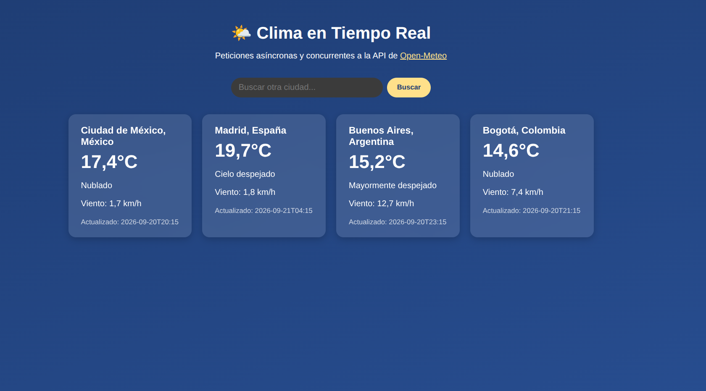

# Clima Async con Django

Pequeña aplicación Django que demuestra el uso de **vistas asíncronas** para
consumir una API externa de clima de forma concurrente, en el contexto del
tema "Scaling Distributed Python Applications".

## ¿Qué hace?

Al entrar a la página, la vista `weather.views.index` (una `async def`)
lanza **varias peticiones HTTP en paralelo** con `httpx.AsyncClient` y
`asyncio.gather`, en lugar de resolverlas una por una:

1. Para cada ciudad, primero geolocaliza el nombre usando el endpoint de
   *geocoding* de [Open-Meteo](https://open-meteo.com/) (API pública,
   gratuita y sin necesidad de API key).
2. Con la latitud/longitud obtenida, consulta el clima actual (temperatura,
   viento, condición del cielo).
3. Todas las ciudades configuradas se resuelven **al mismo tiempo**, no en
   secuencia, gracias a `asyncio.gather`.

Además, hay un formulario de búsqueda para agregar cualquier otra ciudad al
listado sin recargar la lógica de las ciudades por defecto.



### Features extra

- **Caché en memoria** (`WEATHER_CACHE_TTL_SECONDS`, 5 min por defecto) para
  no golpear la API en cada refresh de la misma ciudad.
- **Manejo de errores**: si una ciudad no existe o la API falla, se muestra
  una tarjeta de error en vez de romper toda la página.
- Interfaz simple y responsiva (CSS puro, sin frameworks de frontend).

## Estructura del proyecto

```
manage.py
requirements.txt
clima_project/        # configuración del proyecto Django (settings, urls, asgi/wsgi)
weather/               # app con la lógica de clima
    views.py           # vista async, dispara las peticiones concurrentes
    services.py         # funciones async que llaman a la API de Open-Meteo
    urls.py
    templates/weather/index.html
    static/weather/style.css
```

## Instalación y ejecución

```bash
cd "An Introduction to Scaling Distributed Python Applications"
python3 -m venv .venv
source .venv/bin/activate
pip install -r requirements.txt

python manage.py migrate
python manage.py runserver
```

Abre [http://127.0.0.1:8000/](http://127.0.0.1:8000/) en tu navegador.

Para buscar una ciudad adicional, usa el parámetro `city` en la URL o el
formulario de búsqueda, por ejemplo:
`http://127.0.0.1:8000/?city=Tokyo`.

> Nota: aunque el servidor de desarrollo de Django (`runserver`, basado en
> WSGI) puede ejecutar vistas `async def`, para aprovechar por completo el
> modelo asíncrono en producción se recomienda servir el proyecto con un
> servidor ASGI como `uvicorn` o `daphne` (el proyecto ya incluye
> `clima_project/asgi.py`).

## Ciudades por defecto

Configurables en `clima_project/settings.py` mediante `DEFAULT_CITIES`.

## API utilizada

- [Open-Meteo Geocoding API](https://open-meteo.com/en/docs/geocoding-api)
- [Open-Meteo Forecast API](https://open-meteo.com/en/docs)

No requiere registro ni API key, ideal para fines educativos/demostrativos.
